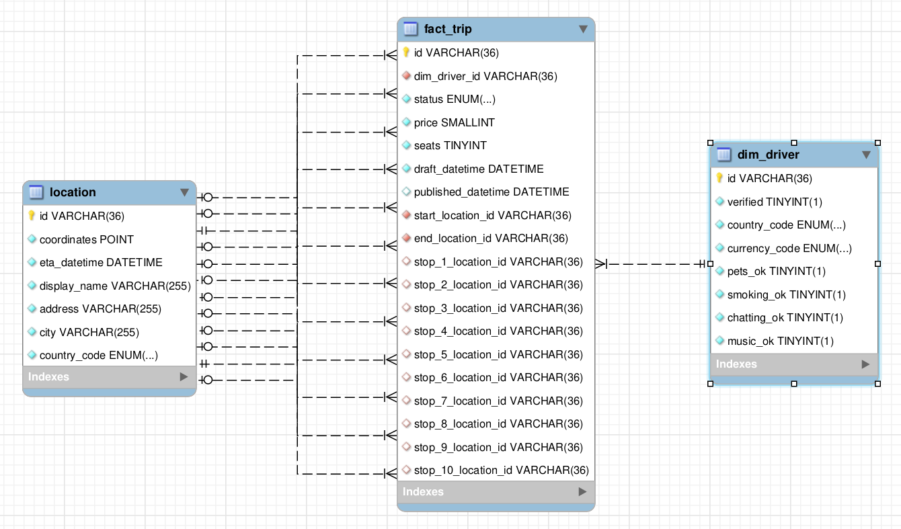

<!-- _class:  lead -->

# BlaBlaCar

## Data Model Documentation

---

### Online analytical processing - Star schema



---

### Trips

A **trip** is an _offer_ from a **driver** to go to different **locations** (at least a _start_ and an _end_, plus max 10 stops).

- **status** : actual status of the trip (`ENUM`, `NOT NULL`, ex. : `"FULL"`)
  - _DRAFT_ : trip not published yet (`published_datetime IS NULL`)
  - _PUBLISHED_ : trip published (`published_datetime IS NOT NULL` )
  - _FULL_ : _no more seats_ available
  - _FINISHED_ : marked _finished_ by driver
  - _CANCELLED_ : marked _cancelled_ by driver
- **price** : price of the trip, set by the driver (`int`, `NOT NULL`, ex. : `123`)
- **seats** : max available seats, set by the driver (`int`, `NOT NULL`, ex. : `2`))
- **draft_datetime** : datetime of last draft save (`datetime`, `NOT NULL`, ex. : `"2022-09-14 17:00:00"`))
- **published_datetime** : datetime of save as a published Trip Offer (`datetime`, ex. : `"2022-09-14 17:23:00"`))
- **start_location_id** : ID of the _trip start_ location (`NOT NULL`)
- **end_location_id** : ID of the _trip end_ location (`NOT NULL`)
- **stop\_{1-10}\_location_id** : ID of _intermediate stop_ location

---

### Locations

A **location** is a _time and place_ of rendez-vous along a **trip**.

- **coordinates** : exact `(lat, lon)` of the location ([Point](https://www.postgresql.org/docs/14/datatype-geometric.html#id-1.5.7.16.5) data type, `NOT NULL`, ex. : `(48.864716, 2.349014)`)
- **eta_datetime** : (estimated) date and time of rendez-vous (`datetime`, `NOT NULL`, ex. : `"2022-09-16 09:00:00"`)
- **display_name** : label of the location (`str`, `NOT NULL`, ex. : `"1, Place Denfert Rochereau, Paris, FR"`)
- **address** : address of the location (`str`, `NOT NULL`, ex. : `"1, Place Denfert Rochereau"`)
- **city** : city of the location (`str`, `NOT NULL`, ex. : `"Paris"`)
- **country_code** : country of the location (`str`, `NOT NULL`, ex. : `"FR"`)

---

### Drivers

A **driver** is a user publishing a _trip offer_.

- **verified** : is the user verified or not (`bool`, `NOT NULL`, ex. : `1`)
- **country_code** : country of the user (`str`, `NOT NULL`, ex. : `"FR"`)
- **currency_code** : currency of the user (`str`, `NOT NULL`, ex. : `"EUR"`)
- **pets_ok** : does the user allow pets or not (`bool`, `NOT NULL`, ex. : `0`)
- **smoking_ok** : does the user allow smoking or not (`bool`, `NOT NULL`, ex. : `0`)
- **chatting_ok** : does the user likes chatting or not (`bool`, `NOT NULL`, ex. : `1`)
- **music_ok** : does the user likes music or not (`bool`, `NOT NULL`, ex. : `1`)

---

### Example queries

#### **_How many trip offers have been published last month?_**

```sql
SELECT COUNT(*) AS count_trips
FROM fact_trip trip
WHERE trip.published_datetime >= DATE_TRUNC('month', CURRENT_DATE - INTERVAL '1 month')
    AND trip.published_datetime < DATE_TRUNC('month', CURRENT_DATE)

```

#### **_What country had the highest number of publications last month?_**

```sql
SELECT driver.country_code, COUNT(*) AS count_trips
FROM fact_trip trip
JOIN dim_driver driver ON fact_trip.dim_driver_id = dim_driver.id
WHERE trip.published_datetime >= DATE_TRUNC('month', CURRENT_DATE - INTERVAL '1 month')
    AND trip.published_datetime < DATE_TRUNC('month', CURRENT_DATE)
GROUP BY driver.country_code
ORDER BY count_trips DESC
LIMIT 1
```
